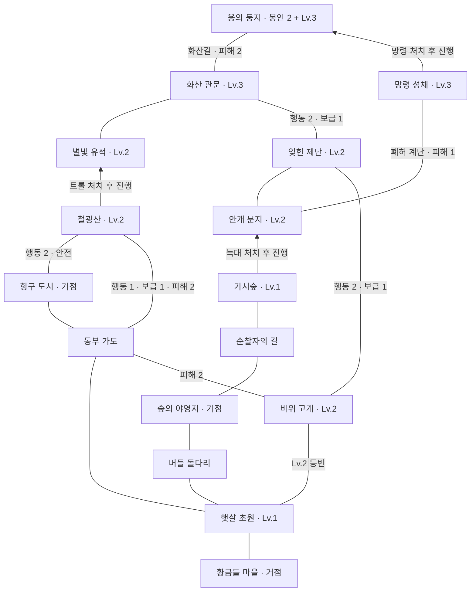

# 엘더폴 v0.6 지역 보드 설계

지도는 16개 지역과 20개 연결 경로로 구성한다. 지역 ID는 기존 저장과 퀘스트의 호환을 위해 유지하며 좌표상 인접 관계는 사용하지 않는다. 화면에서 보이는 선과 실제 이동 검사는 `game-engine.js`의 `routes`를 함께 사용한다.

핵심 결정은 여행의 시간·위험·보급과 거점 왕복이다. 초원에서 서쪽 다리를 건너 북쪽 사냥터로 갈지, 동부 가도로 항구에 갈지, 장비와 보급을 챙겨 산을 넘어 제단을 조사할지 고른다.

화살표는 수호 적을 처치해야 앞으로 갈 수 있는 방향. 반대쪽에서 안전하게 돌아오는 길은 열려 있다. 보통 길은 양방향이며 표기 없는 경로는 행동 1·보급 0·고정 피해 0.

| 선택 | 여행 비용 | 의미 |
| --- | --- | --- |
| 동부 가도→항구→광산 | 행동 3·보급 0·피해 0 | 보급을 아끼고 거점에서 정비할 수 있는 우회로 |
| 동부 가도→광산 여울 | 행동 1·보급 1·피해 2 | 시간을 아끼지만 전투 전에 체력과 보급을 잃음 |
| 초원→고개→제단 | 행동 3·보급 1, Lv.2부터 | 늑대를 우회해 제단에 도달 |
| 초원→다리→야영지→숲→분지→제단 | 행동 6, 늑대 처치 필요 | 보급을 아끼고 거점을 이용하는 서쪽 길 |
| 제단→화산 관문→용의 둥지 | 행동 3·보급 1·고정 피해 2 | 북쪽 고개와 화산길을 넘는 레이드 경로 |
| 망령 성채→용의 둥지 | 행동 1, 망령 처치 필요 | 세 번째 봉인을 모아 용을 약화하고 회랑으로 진입 |

표는 해당 지역을 감당할 레벨의 영웅 기준이다. 더 높은 난이도의 지역으로 진입할 때 영웅 레벨이 낮다면 차이당 추가 피해 2. 같은 난이도·낮은 지역으로 귀환할 때 추가 피해는 없다. 산악 등반 레벨 조건은 낮은 난이도로 내려가는 방향에 적용하지 않는다.

지역을 선택하면 현재 자원으로 가능한 한 구간 비용이 표시된다. 하단의 이동 확정으로 실행하며 일반 이동은 팝업을 요구하지 않는다. 「여행 계획」은 목표와 거점까지 현재 자원으로 완주 가능한 안전/행동 절약 경로를 비교한다. 중간 회복·구매와 미래 사건은 포함하지 않는다. 첫 구간만 확정하므로 계속 상황을 판단할 수 있다.

## 저장 호환

v0.5와 동일한 캠페인 저장 키를 사용한다. 기존 지역에 있는 영웅은 위치를 유지하고 새 지도에 없는 칸의 영웅만 가장 가까운 거점으로 옮긴다. 성장·장비·퀘스트·진행 중 전투는 보존한다. 갱신 전 원본도 별도 키에 백업한다.

## 검증

독립적인 명시 경로로 수집·호위·늑대·트롤·보고·성장·용 처치 캠페인을 수행한다. 이동의 원자적 비용, 제한, 왕복, 경로 비교와 저장 호환은 엔진 검사로, 선과 지역 수·확정 동작·팝업·터치 영역·문서 스크롤은 브라우저 검사로 확인한다. 사람의 여행 선택과 장기 캠페인 밸런스는 별도 플레이 테스트가 필요하다.
